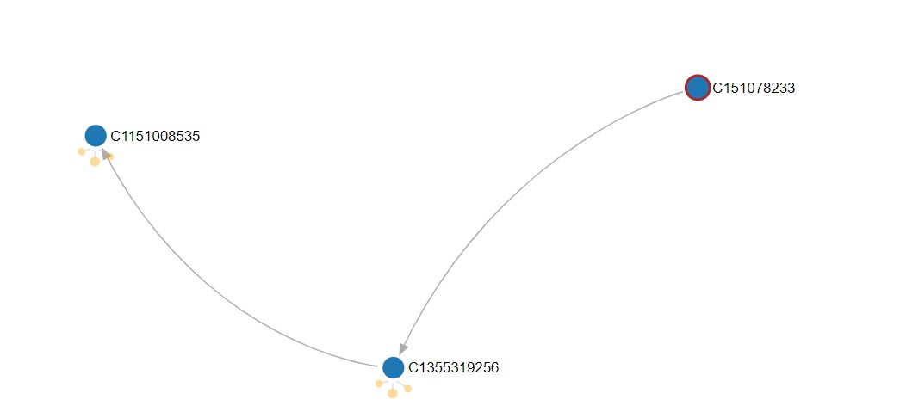
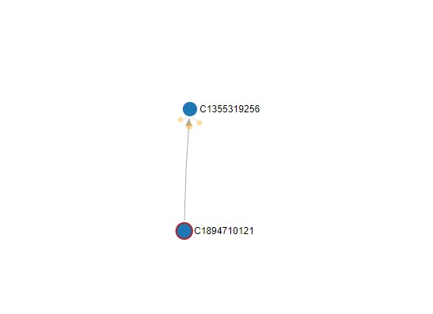

# Sample Graph Queries

## Simple Queries

### Retrieve all verices with account

```
 `g.V().hasLabel('account')`
```

### Retrieve edges that label CASH_IN

```
> `g.E().hasLabel('CASH_IN') `
```

### Get a vertex by id

```
> `g.V().hasId('C551495160') or g.V('C551495160')`
```

### Retrieves incoming CASH_IN for account C551495160

```
> `g.V('C551495160').inE().hasLabel('CASH_IN')`
```

- count: 18

### Retrieves both incoming and outgoing edges for account C551495160

```
> `g.V('C551495160').bothE()`
```

- count: 70

### Retrieves the source vertices/accounts of the incoming edges of account C551495160

```
> `g.V('C551495160').inE().outv()`
```

- count: 70

### Traverses from C546116488 to the target vertices and get their ID: C551495160

```
> `g.V('C546116488').outE().inV().id()`
```

---

## Complex Queries

Accounts of interest to track:

> many accounts(e.g. C17093120) -> C1355319256 -> C1151008535 <- many accounts(C1957081864)

**_Graph Traversal 1_**:

Accounts that received 'CASH_OUT' from C151078233 and did 'CASH_IN' to another account.

i.e. C151078233 did 'CASH_OUT' to C1355319256 and C1355319256 did a 'CASH_IN' to C1151008535

```
g.V().
    has('accountId','C151078233'). #select vertices with accountId C151078233
    outE('CASH_OUT'). #select outgoing edges with label CASH_OUT
    inV(). #select incoming vertices
    outE('CASH_IN'). #select outgoing edges with label CASH_IN
    inV() #select incoming vertices
```

or

`g.V('C151078233').out('CASH_OUT').out('CASH_IN')`

- Result _C1151008535_ is the target vertex. [Image](images/graph_traversal_1.jpg)

**_Graph Traversal 2:_**

List of account that have 'DEBIT' into account that received 'TRANSFER' from account C89143842. i.e. C89143842 did 'TRANSFER' to C1530856786, C1530856786 received 'DEBIT' from C371876102

```
g.V().
    has('accountId','C89143842'). #select vertices with accountId C89143842
    outE('TRANSFER'). #select outgoing edges with label TRANSFER
    inV(). #select incoming vertices
    inE('DEBIT'). # select incoming edges with label DEBIT
    outV() #select outgoing vertices
```

or

`g.V('C89143842').out('TRANSFER').in('DEBIT')`

- Result: _C371876102_

**_Graph Traversal 3:_**

From list of accounts that did CASH_OUT to 'C239700190' , Identify other accounts that also received CASH_OUT from the same source account(s)

i.e. C239700190 received from 10 accounts, out of these 10 accounts 1 account (C325952657) sent to C1521704415

```
g.V('C239700190'). # select vertex with accountId C239700190
    inE('CASH_OUT'). # select incoming edges with label CASH_OUT
    outV(). # select outgoing vertices
    outE('CASH_OUT'). # select outgoing edges with label CASH_OUT
    inV() #select incoming vertices
```

or

`g.V().has('accountId','C239700190').in('CASH_OUT').out('CASH_OUT')`

- Result: _C239700190_ and _C1521704415_

**_Graph Traversal 4:_**

Filter accounts that used 'TRANSFER' method to send money to C1355319256. 

`g.V().has('accountId','C1355319256').inE('TRANSFER').otherV()`

**_Graph Traversal 5:_**

Filter accounts that used 'CASH_IN' method to send money to C1355319256 and have 'newbalanceDest' greater than or equal to 0. 

`g.V().has('accountId','C1355319256').inE('CASH_IN').has('newbalanceDest', gt(0)).otherV()`

**_Graph Traversal 6:_**

Finding the maximum depth of a tree starting from a specified root vertex can be determined as follows:

`g.V().has('accountId','C1355319256').repeat(__.in()).emit().path().count(local).max()`

**_Graph Traversal 7:_**

number of edges associated to each vertex: Degree Centrality

`g.V().has('accountId',within(['C1300968616'])).group().by().by(bothE().count())`

**_Graph Traversal 8:_**

`g.V().has('accountId','C1355319256').inE('CASH_IN').has('newbalanceDest', gt(0)).otherV()`

**_Graph Traversal 9:_**

Shortest Path finding operation

`g.V().until(has('accountId','C1355319256')).repeat(both())`

---

## Reference

- `in => source`
- `out => target`
- `out() => outE().inV()`
- `in() => inE().outV()`
- `has` - specify a tuple of key and value that the entity must-have.
- `hasLabel` - a shortcut to the equivalent - has('label', 'value of the label').
- `hasNot` - specify a tuple of key and value that the entity must not have.
- `is`, `not`, `and`, `or` - Boolean operators to combine conditions.
- `where` - can be used to compare the current position in a traversal when combined with a - - select(), but also used on its own to filter on a condition.
- `dedup` - remove duplicates at the current position in the traversal.
- `range` - return a range of entities, specified as (from, to).
- `select` - allows the graph to be examined from a previous step in a traversal.
- `simplePath` - stops a traversal from reusing a part of the previous path in the traversal.
- `cyclicPath` - allows the reuse of part of the previous path.

- Nodes of interest to track:
- C873309260 and C1335061928


      "amount": 62432.51,
      "oldbalanceOrg": 234,
      "oldbalanceDest": 332547.99,
      "newbalanceDest": 394980.5,